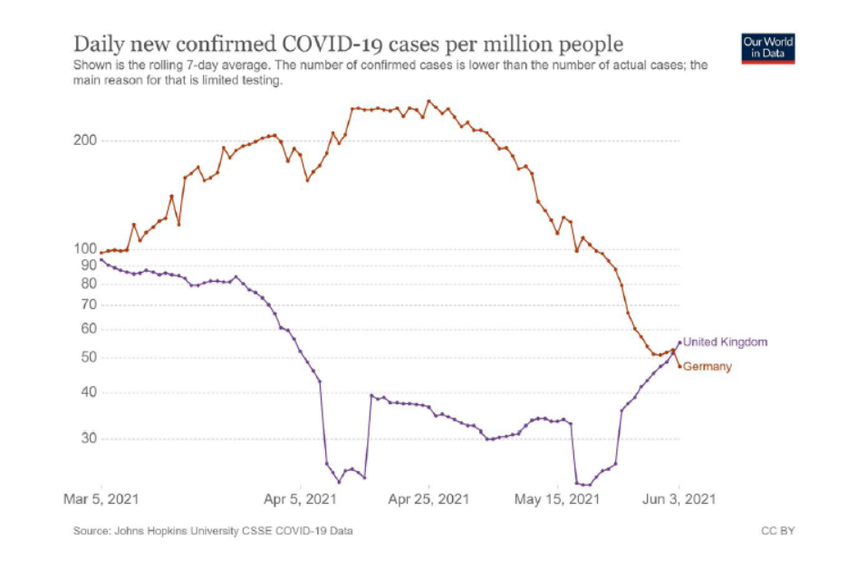
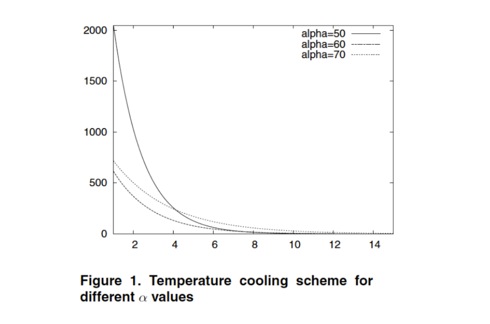
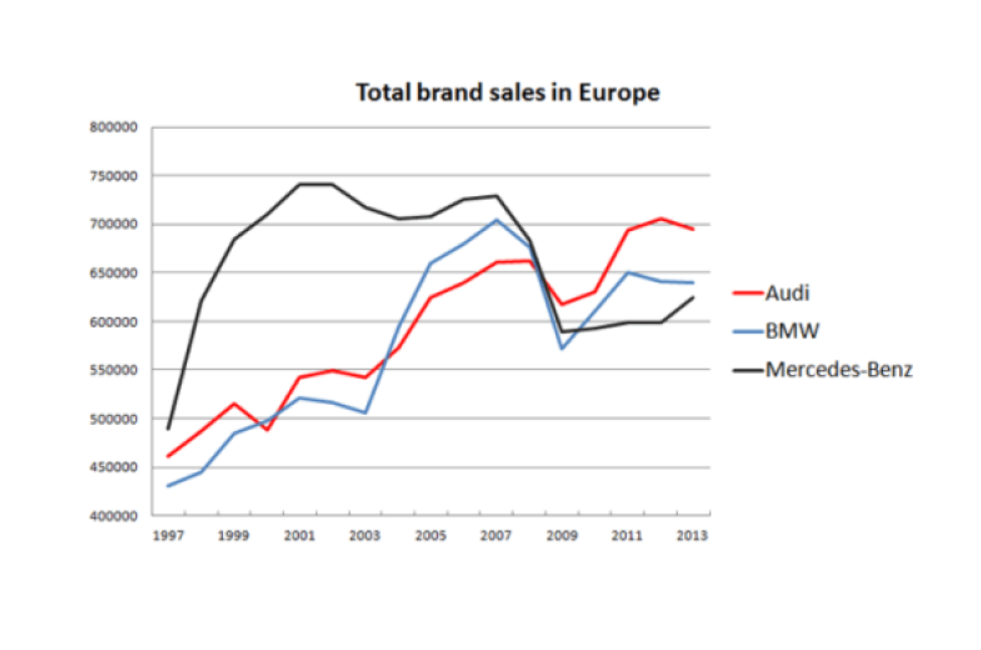

{
 "cells": [
  {
   "cell_type": "markdown",
   "id": "550e0de4-0739-4dfa-896e-13df55ba31b4",
   "metadata": {},
   "source": [
    "## Applying checklist of good graphics\n",
    "\n",
    "### Graph 1: \n",
    "\n",
    "\n",
    "\n",
    "### Brief Interpretation :\n",
    "\n",
    "There are more plots on the graph than required. The axes' labels are vague and poorly defined. A curve with distinct values on the x and y axes or a multiple bar graph would be preferable ways to visualize the graph. Overall, it appears from the graph interpretation that Germany is seeing a rise in COVID instances relative to the UK, and towards the conclusion, this trend begins to reverse. However, from a wider perspective, the specific details remain unclear.\n",
    "\n",
    "#### Data\n",
    "1.  [ ] The type of the graphic is adapted to the nature of data (curve, bars, pie, histograam, cloud..)\n",
    "2.  [ ] Approximations/interpolation make sense\n",
    "3.  [x] Curves are defined by a sufficient number of points\n",
    "4.  [x] The building method of the curve is clear : interpolation (linear, polynomial, regression..)\n",
    "5.  [ ] Confidence intervals are visualized (or given separately)\n",
    "6.  [ ] Steps of histograms are adequate\n",
    "7.  [ ] Histograms visualize probabilities (from 0 to 1)\n",
    "\n",
    "#### Graphical objects\n",
    "1. [x] Graphical objects are readable on screen, on printed version (B/W), on video..\n",
    "2. [x] Graphic range is standard, without too similar colors, without green(video)\n",
    "3. [ ] Axis identified and labelled\n",
    "4. [ ] Scales and units are explicits\n",
    "5. [x] Curves cross without ambiguity\n",
    "6. [x] Grids help the reader\n",
    "\n",
    "#### Annotation\n",
    "1. [ ] Axis are labelled by quantities\n",
    "2. [ ] Labels of the axis are clear, and self contained\n",
    "3. [ ] Units are indicated on the axis\n",
    "4. [x] Axes are oriented from the left to the right and from the bottom to the top\n",
    "5. [ ] Origin is (0,0), if not it should be clearly justified\n",
    "6. [ ] No Hole on the axes\n",
    "7. [ ] For bar graphs/histograms order of bars is based on classical ordering (alphabetical, temporal, from the best to the worse) are better than a random order\n",
    "8. [x] Each curve has a legend\n",
    "9. [ ] Each bar has a legend\n",
    "\n",
    "\n",
    "#### Information\n",
    "1. [x] Curves are on the same scale\n",
    "2. [x] The number of curves on a same graph is small (less than 6)\n",
    "3. [x] Compare curves on a same graphic\n",
    "4. [ ] A curve cannot be removed without reducing the information\n",
    "5. [x] The graphic gives a relevant information to the reader\n",
    "6. [ ] If the vertical axis shown averages, it should indicates error bars\n",
    "7. [ ] It is not possible to remove any object without modifying the readability of the graphic\n",
    "\n",
    "#### Context\n",
    "1. [ ] All the symbols are defined and referenced in the text \n",
    "2. [ ] The graphic produces more information than any other representation (choice of the variable)\n",
    "3. [x] The graphic has a title\n",
    "4. [x] The title is sufficiently self contained to partially  understand the graphic\n",
    "5. [x] The graphic is referenced in the text\n",
    "6. [ ] The text comment the figure \n",
    "\n",
    "- [x] The graphical representation should be elegant\n",
    "\n",
    "\n",
    "### Graph 2: \n",
    "\n",
    "\n",
    "\n",
    "### Brief Interpretation:\n",
    "\n",
    "The lack of units on the graph's axes causes the graph to appear hazy. The title and the curve's legends are the only ways to understand that temperature cooling is observed for various values of alpha; the graphic fails to provide the necessary information on which units.There is ambiguity between the curves and the distinction between two curves ( alpha 60 and alpha 70) seem identical.\n",
    "\n",
    "#### Data\n",
    "1.  [ ] The type of the graphic is adapted to the nature of data (curve, bars, pie, histograam, cloud..)\n",
    "2.  [ ] Approximations/interpolation make sense\n",
    "3.  [ ] Curves are defined by a sufficient number of points\n",
    "4.  [ ] The building method of the curve is clear : interpolation (linear, polynomial, regression..)\n",
    "5.  [ ] Confidence intervals are visualized (or given separately)\n",
    "6.  [ ] Steps of histograms are adequate\n",
    "7.  [ ] Histograms visualize probabilities (from 0 to 1)\n",
    "\n",
    "#### Graphical objects\n",
    "1. [x] Graphical objects are readable on screen, on printed version (B/W), on video..\n",
    "2. [ ] Graphic range is standard, without too similar colors, without green(video)\n",
    "3. [ ] Axis identified and labelled\n",
    "4. [ ] Scales and units are explicits\n",
    "5. [ ] Curves cross without ambiguity\n",
    "6. [ ] Grids help the reader\n",
    "\n",
    "#### Annotation\n",
    "1. [ ] Axis are labelled by quantities\n",
    "2. [ ] Labels of the axis are clear, and self contained\n",
    "3. [ ] Units are indicated on the axis\n",
    "4. [x] Axes are oriented from the left to the right and from the bottom to the top\n",
    "5. [x] Origin is (0,0), if not it should be clearly justified\n",
    "6. [x] No Hole on the axes\n",
    "7. [ ] For bar graphs/histograms order of bars is based on classical ordering (alphabetical, temporal, from the best to the worse) are better than a random order\n",
    "8. [x] Each curve has a legend\n",
    "9. [ ] Each bar has a legend\n",
    "\n",
    "\n",
    "#### Information\n",
    "1. [x] Curves are on the same scale\n",
    "2. [x] The number of curves on a same graph is small (less than 6)\n",
    "3. [x] Compare curves on a same graphic\n",
    "4. [ ] A curve cannot be removed without reducing the information\n",
    "5. [ ] The graphic gives a relevant information to the reader\n",
    "6. [ ] If the vertical axis shown averages, it should indicates error bars\n",
    "7. [ ] It is not possible to remove any object without modifying the readability of the graphic\n",
    "\n",
    "#### Context\n",
    "1. [ ] All the symbols are defined and referenced in the text \n",
    "2. [ ] The graphic produces more information than any other representation (choice of the variable)\n",
    "3. [x] The graphic has a title\n",
    "4. [x] The title is sufficiently self contained to partially  understand the graphic\n",
    "5. [ ] The graphic is referenced in the text\n",
    "6. [ ] The text comment the figure \n",
    "\n",
    "- [x] The graphical representation should be elegant\n",
    "\n",
    "\n",
    "### Graph 3: \n",
    "\n",
    "\n",
    "\n",
    "### Brief Interpretation:\n",
    "\n",
    "Basic data is shown on the graph year-by-year, with appropriate curve legends. The overall information for each brand  can be examined even though the axes have no defined units. Each plot can be shown through a point and the axes with appropriate legends would have made the graphic much better. At the middle, there is  is ambiguity between the curves, and also, a black-and-white graphic would not clearly depict the curve distinction.\n",
    "\n",
    "#### Data\n",
    "1.  [x] The type of the graphic is adapted to the nature of data (curve, bars, pie, histograam, cloud..)\n",
    "2.  [x] Approximations/interpolation make sense\n",
    "3.  [x] Curves are defined by a sufficient number of points\n",
    "4.  [x] The building method of the curve is clear : interpolation (linear, polynomial, regression..)\n",
    "5.  [ ] Confidence intervals are visualized (or given separately)\n",
    "6.  [ ] Steps of histograms are adequate\n",
    "7.  [ ] Histograms visualize probabilities (from 0 to 1)\n",
    "\n",
    "#### Graphical objects\n",
    "1. [ ] Graphical objects are readable on screen, on printed version (B/W), on video..\n",
    "2. [x] Graphic range is standard, without too similar colors, without green(video)\n",
    "3. [ ] Axis identified and labelled\n",
    "4. [ ] Scales and units are explicits\n",
    "5. [ ] Curves cross without ambiguity\n",
    "6. [x] Grids help the reader\n",
    "\n",
    "#### Annotation\n",
    "1. [ ] Axis are labelled by quantities\n",
    "2. [ ] Labels of the axis are clear, and self contained\n",
    "3. [ ] Units are indicated on the axis\n",
    "4. [x] Axes are oriented from the left to the right and from the bottom to the top\n",
    "5. [ ] Origin is (0,0), if not it should be clearly justified\n",
    "6. [x] No Hole on the axes\n",
    "7. [ ] For bar graphs/histograms order of bars is based on classical ordering (alphabetical, temporal, from the best to the worse) are better than a random order\n",
    "8. [x] Each curve has a legend\n",
    "9. [ ] Each bar has a legend\n",
    "\n",
    "\n",
    "#### Information\n",
    "1. [x] Curves are on the same scale\n",
    "2. [x] The number of curves on a same graph is small (less than 6)\n",
    "3. [x] Compare curves on a same graphic\n",
    "4. [ ] A curve cannot be removed without reducing the information\n",
    "5. [x] The graphic gives a relevant information to the reader\n",
    "6. [ ] If the vertical axis shown averages, it should indicates error bars\n",
    "7. [ ] It is not possible to remove any object without modifying the readability of the graphic\n",
    "\n",
    "#### Context\n",
    "1. [ ] All the symbols are defined and referenced in the text \n",
    "2. [ ] The graphic produces more information than any other representation (choice of the variable)\n",
    "3. [x] The graphic has a title\n",
    "4. [x] The title is sufficiently self contained to partially  understand the graphic\n",
    "5. [ ] The graphic is referenced in the text\n",
    "6. [ ] The text comment the figure \n",
    "\n",
    "- [x] The graphical representation should be elegant\n",
    "\n"
   ]
  }
 ],
 "metadata": {
  "kernelspec": {
   "display_name": "Python 3 (ipykernel)",
   "language": "python",
   "name": "python3"
  },
  "language_info": {
   "codemirror_mode": {
    "name": "ipython",
    "version": 3
   },
   "file_extension": ".py",
   "mimetype": "text/x-python",
   "name": "python",
   "nbconvert_exporter": "python",
   "pygments_lexer": "ipython3",
   "version": "3.11.4"
  }
 },
 "nbformat": 4,
 "nbformat_minor": 5
}
